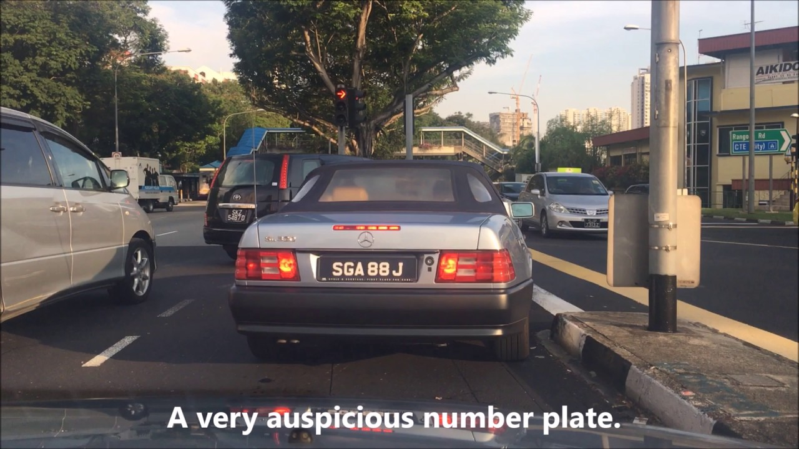
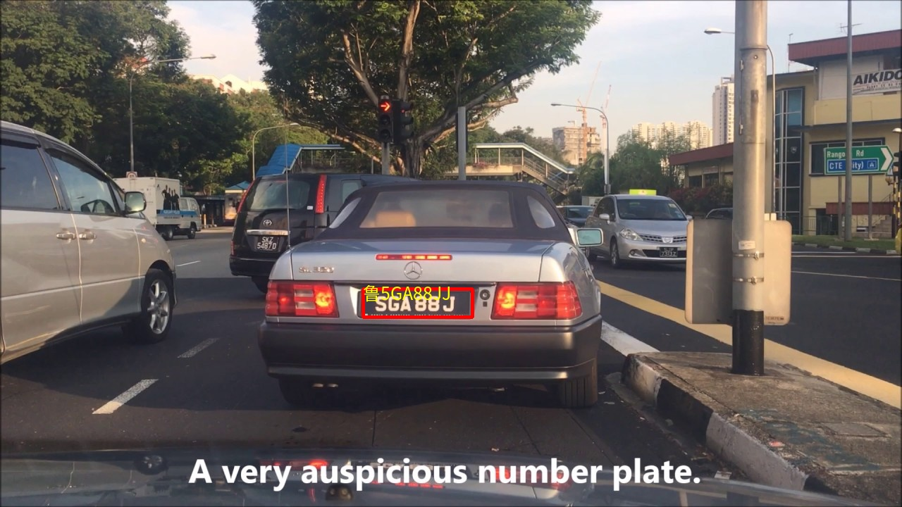
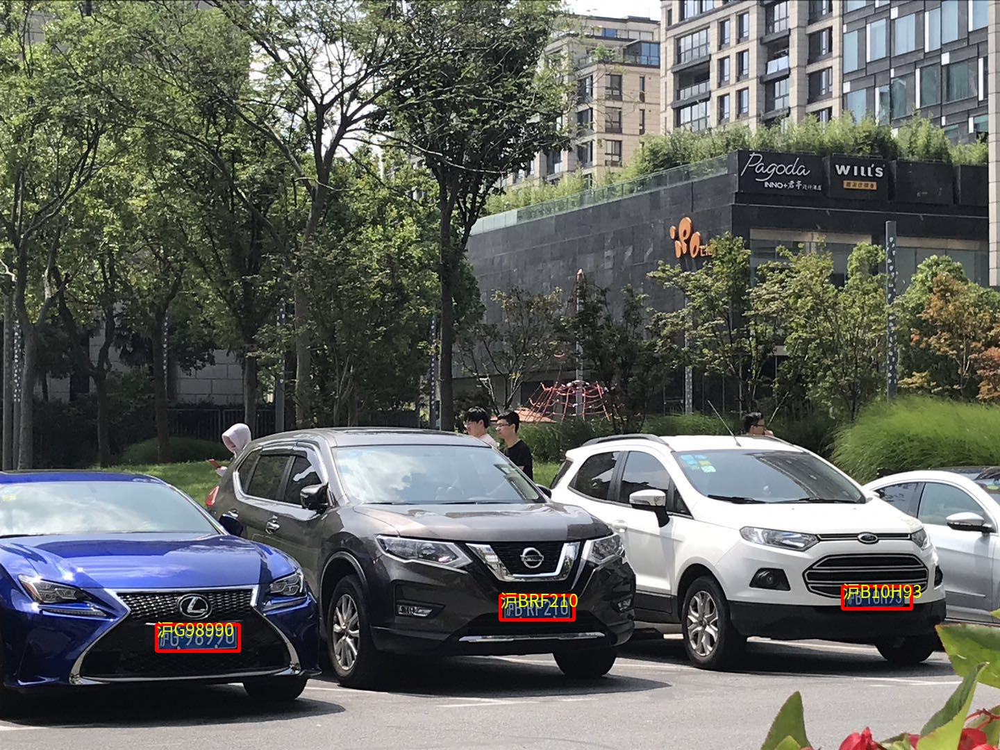

# License_Plate_Detection_Recognition_Pytorch
## This repo is refers to the problem 3 in the technical assessment
1) [YOLOv5](https://github.com/ultralytics/yolov5) is being used for license plate detection. 
2) [LPRNet](https://arxiv.org/abs/1806.10447) is being used for license plate recognition (detect character on license plate).
3) [Spatial Transformer Layer](https://arxiv.org/abs/1506.02025) is embeded in this work to allow a better characteristics for recognition.

## Tasks Completed:
1) [Training data](https://www.kaggle.com/andrewmvd/car-plate-detection) for license plate detection.
2) [YOLOv5 training guide](https://github.com/ultralytics/yolov5/wiki/Train-Custom-Data) for license plate detection.
3) YOLOv5s network which is a shrink network from YOLOv5 is being used for the purpose of lower inference time.
4) Combined YOLOv5 network together with LPRNet and STL to detect and recognize license plate.

## Results:
P/S: The detection result is accurate whereas the recognition result is not since the weights for the LPRNet was not being retrained again due to the lack of dataset from online resource. It is important to note that the original weights for LPRNet is from this [author](https://github.com/xuexingyu24/License_Plate_Detection_Pytorch). The [LPRNet weight](https://github.com/xuexingyu24/License_Plate_Detection_Pytorch/blob/master/LPRNet/weights/Final_LPRNet_model.pth) was specifically trained to recognize China License Plate character. Looking at the photos attached below, you can see that the character recognition is superior for China License Plate and vice-versa for Singapore License Plate. To see more results, please look at the [test_result](https://github.com/ziimiin14/License_Plate_Detection_Recognition/tree/master/test_result) folder, it contains a series of China and Singapore cars for detection and recognition.

 
 

## LPRNet dependencies
pytorch >= 1.0.0
opencv-python 3.x
python 3.x
imutils
Pillow
numpy

## YOLOv5 dependencies
# base ----------------------------------------
matplotlib>=3.2.2
numpy>=1.18.5
opencv-python>=4.1.2
Pillow
PyYAML>=5.3.1
scipy>=1.4.1
torch>=1.7.0
torchvision>=0.8.1
tqdm>=4.41.0

# logging -------------------------------------
tensorboard>=2.4.1
# wandb

# plotting ------------------------------------
seaborn>=0.11.0
pandas

# export --------------------------------------
# coremltools>=4.1
# onnx>=1.9.0
# scikit-learn==0.19.2  # for coreml quantization

# extras --------------------------------------
# Cython  # for pycocotools https://github.com/cocodataset/cocoapi/issues/172
pycocotools>=2.0  # COCO mAP

# Test
* run "python3 main.py --weights 

## Reference
* [MTCNN](https://arxiv.org/abs/1604.02878v1)
* [LPRNet](https://arxiv.org/abs/1806.10447)
* [Spatial Transformer Layer](https://arxiv.org/abs/1506.02025)
* [LPRNet_Pytorch](https://github.com/sirius-ai/LPRNet_Pytorch)

**Please give me a star if it is helpful for your research**
